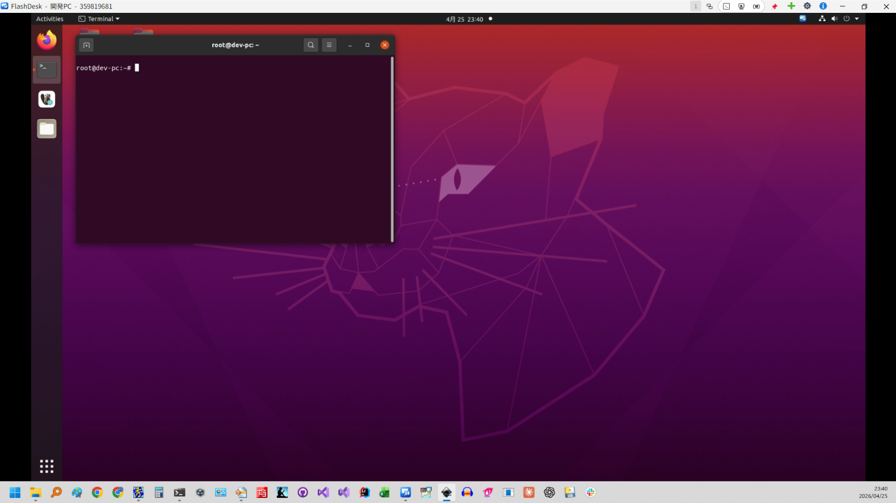
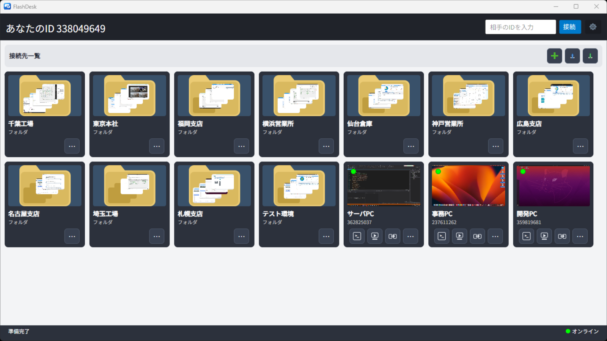
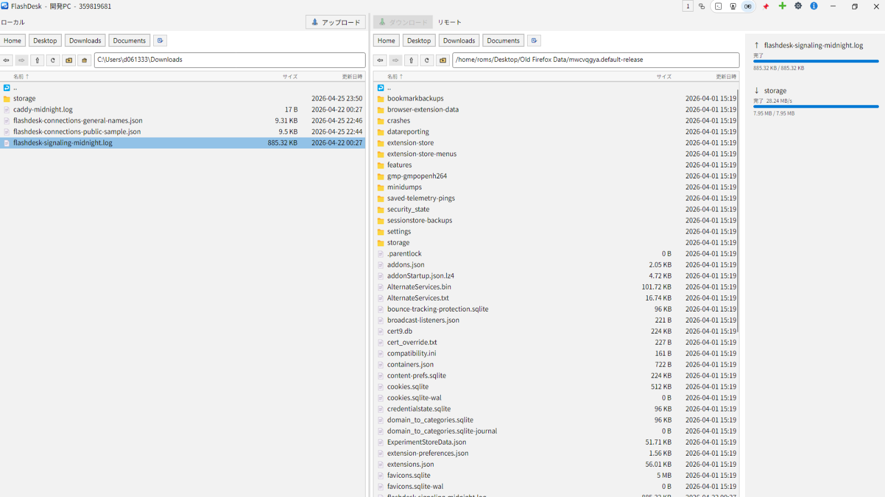
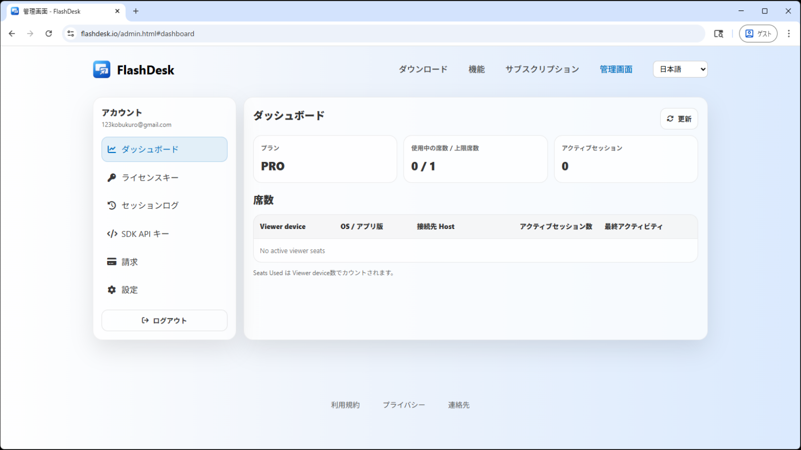
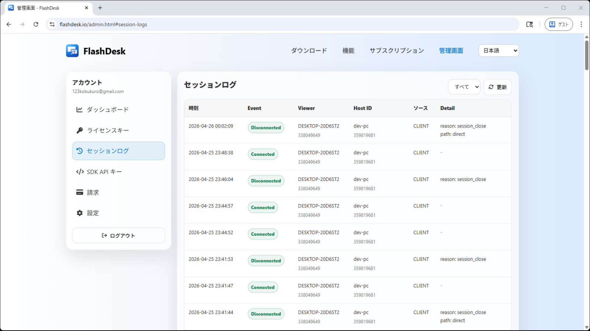

# FlashDesk

All-in-one remote desktop for work and support.

FlashDesk is a lightweight tool designed for real remote work.

- Remote desktop (screen sharing & control)
- SSH (CLI access)
- File transfer
- Session recording
- Connection management
- P2P connection with relay fallback

Works on Windows, macOS, Linux.
Supports 27 languages, including English.

Free for personal use  
Commercial use: $6.99 / seat / month  

Download: [https://flashdesk.io/](https://flashdesk.io/)

