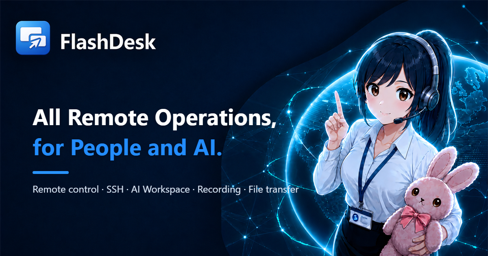
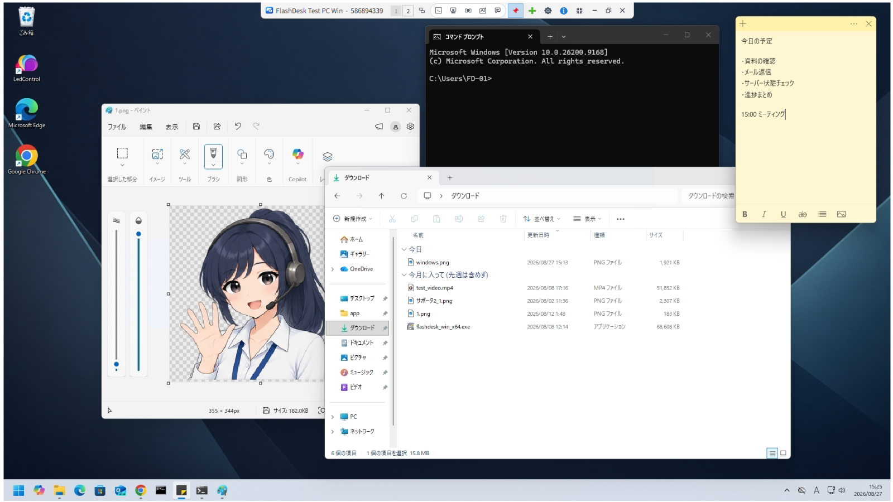
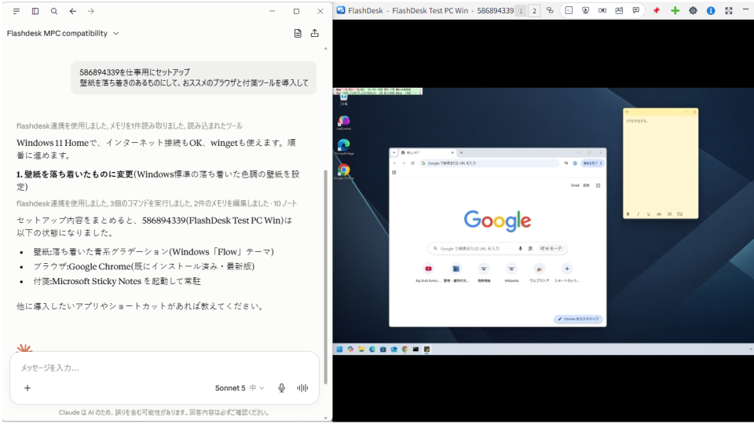
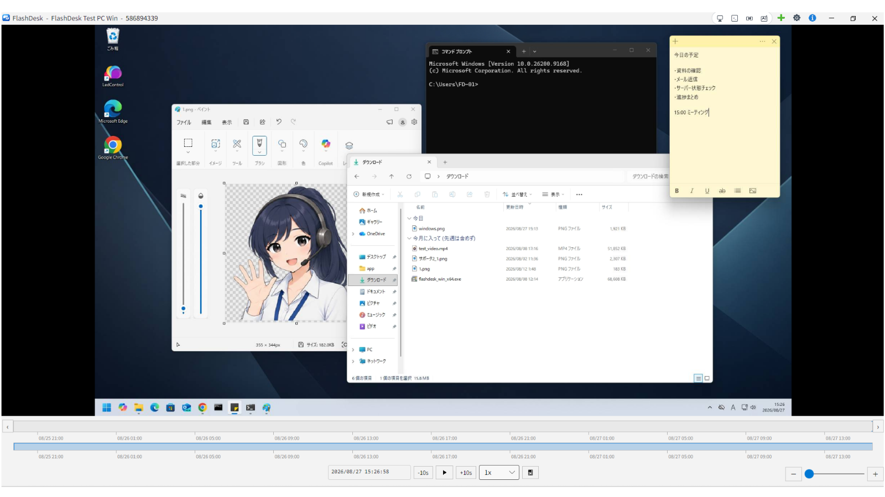

# FlashDesk

**English** | [日本語](#日本語)

All your remote work tools in one lightweight app — for people **and** AI.

FlashDesk brings screen sharing, remote control, SSH, session recording, file transfer, and connection
management together, so remote work and remote support move faster with less tool-switching. It also
exposes an **MCP server**, so AI tools like Claude Code can operate a remote machine's desktop directly.

## Features

- **Remote desktop** — screen sharing and full remote control
- **SSH** — built-in remote terminal
- **File transfer** — move files and folders both ways
- **Session recording** — record sessions and export to **MP4**
- **Connection management** — organize and reuse saved connections
- **AI control (MCP)** — let Claude Code / Codex / Cursor operate a remote machine's GUI ([details](https://flashdesk.io/mcp.html))
- **P2P first** — direct device-to-device connection, with encrypted relay fallback

## Platforms

Windows / macOS / Linux (incl. Wayland) / Android / iOS. Available in 27 languages, including English and Japanese.

## Pricing

- **Free** for personal, non-commercial use
- **Pro** for business / commercial use: **¥980 (about $6.99) / seat / month**
  A "seat" is a device used on the controlling (Viewer) side; the remote machines you connect to don't consume seats.

## Download

**https://flashdesk.io/**

- Security overview: https://flashdesk.io/security.html
- Control FlashDesk from AI tools (MCP): https://flashdesk.io/mcp.html — see also [flashdesk-mcp](https://github.com/flashdesk/flashdesk-mcp)

---

## 日本語

[English](#flashdesk) | **日本語**

リモートワークの道具を1つにまとめた軽量アプリ。**人にも AI にも**使えます。

画面共有・遠隔操作・SSH・録画・ファイル転送・接続管理を1つにまとめ、リモート作業とリモートサポートを
ツールの切り替えなしで速くします。さらに **MCP サーバー**を内蔵し、Claude Code などの AI ツールから
別のマシンのデスクトップを直接操作できます。

### 機能

- **遠隔デスクトップ** — 画面共有とフル遠隔操作
- **SSH** — リモートターミナル内蔵
- **ファイル転送** — ファイル・フォルダを双方向で
- **録画** — セッションを録画し **MP4** で書き出し
- **接続管理** — 保存した接続を整理・再利用
- **AI 操作（MCP）** — Claude Code / Codex / Cursor から別マシンの GUI を操作（[詳細](https://flashdesk.io/mcp.html)）
- **P2P 優先** — 端末間の直接接続、届かない時は暗号化リレーに自動切替

### 対応プラットフォーム

Windows / macOS / Linux（Wayland 対応）/ Android / iOS。英語・日本語を含む 27 言語対応。

### 料金

- 個人の**非商用**利用は**無料**
- 業務・商用は **Pro：月 ¥980（約 $6.99）／席**
  「席」は操作する側（Viewer）の端末数です。接続される側のマシンは何台あっても席を消費しません。

### ダウンロード

**https://flashdesk.io/**

- セキュリティ: https://flashdesk.io/security.html
- AI ツールから操作（MCP）: https://flashdesk.io/mcp.html ／ [flashdesk-mcp](https://github.com/flashdesk/flashdesk-mcp)
